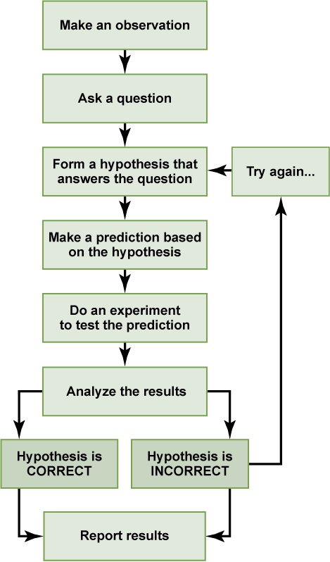

# Goal

Define a runbook of sorts of how to run a common incident response process to ensure that we are working on the right thing, keeping all stakeholders in loop, assigning focus roles, and getting to the root cause of the incident or at least mitigating the problem.


# What is an P1 incident

An incident is when there is a customer visible outage that interrupts the behavior or functionality of the platform.

## Examples of incidents:

* Customer is unable to deploy
* Run out of nodes to launch
* Critical certificate expires
* Config Management system is down

# Base Process

[Five whys](https://en.wikipedia.org/wiki/Five_whys) - The primary goal of the technique is to determine the root cause of a defect or problem by repeating the question "Why?"

```
Why? – The battery is dead. (First why)
Why? – The alternator is not functioning. (Second why)
Why? – The alternator belt has broken. (Third why)
Why? – The alternator belt was well beyond its useful service life and not replaced. (Fourth why)
Why? – The vehicle was not maintained according to the recommended service schedule. (Fifth why, a root cause)
```


1. Validate there is a problem and this problem is a P1 Incident as of the ilk described above.
2. Create a Jira Ticket in the IM or SRE board
3. Create a slack war-room, slack public channel, and invite all that are needed to help. You are not alone in an incident, this is not a runbook event, this is an outage affecting customers or members.
4. Announce in #tech-outage
5. Assign Roles
6. Isolate and record experiments by coordinating with roles of the IM
7. Log for future Post Mortem
8. Update Stakeholders every 15 to 45 minutes 
9. Log all manual changes
10. Verify problem
11. Five Whys
12. Verify recovery
13. Announce resolved (Yellow Status)
14. Announce resolved (Green status) when tech-debt is cleaned up after the customer verifies the fix


# Roles

*Communicator* - This role requires the person to give updates, even if there are none to the stakeholders’ slack channel(s) any and all updates of the current incident 

*Recorder* - A incident document is created, after the base jira procedure is followed, a log of sorts of what is tried and did not work

*Lead* - The lead works with the communicator and the Team coordinating different ICs to try distinct experiments to determine the root cause of incident.

*IC* - The end engineer working on the problem, coordinating with the lead and other ICs to ensure that the experiments do not interfere with other ICs and are recorded by the recorder.


Follow the incident response process by focusing on what are we fixing, what is broken, and how with data-did or did not verify our assumptions. We follow an experiment process described below, whilst communicating what step of the experiment you are at with the team.



# Resources 

https://en.wikipedia.org/wiki/Five_whys

https://www.kitchensoap.com/2012/02/10/each-necessary-but-only-jointly-sufficient/

https://courses.lumenlearning.com/boundless-psychology/chapter/the-scientific-method/


